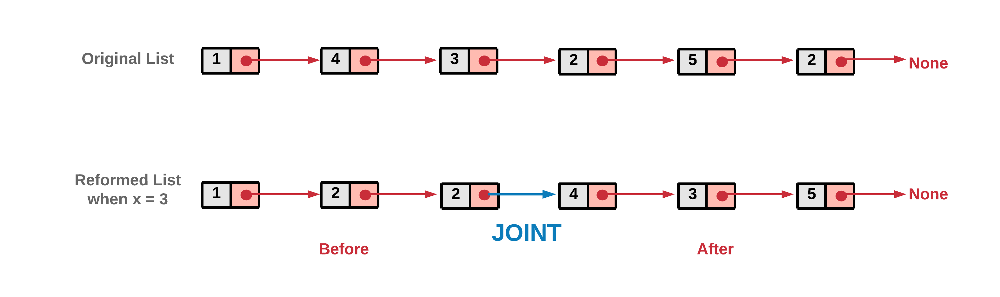

## 18 分隔链表


给定一个链表和一个特定值 x，对链表进行分隔，使得所有小于 x 的节点都在大于或等于 x 的节点之前。

你应当保留两个分区中每个节点的**初始相对位置**。


示例:

```
输入: head = 1->4->3->2->5->2, x = 3
输出: 1->2->2->4->3->5
```

[86. 分隔链表](https://leetcode-cn.com/problems/partition-list/)


### 双指针法 + 拆分

解题思路：本题要求改变链表结构，使得值小于 x 的元素，位于值大于等于 x 元素的前面。这实质上意味着在改变后的链表中有某个点，在该点之前的元素全部小于 x，该点之后的元素全部大于等于 x。将这个点记为 JOINT。




对该问题的逆向工程，如果在 JOINT 将改后链表拆分，会得到两个更小的链表，其中一个包括全部值小于 x 的元素，另一个包括全部值大于 x 的元素。在解法中，主要目的是创建这两个链表，并将它们连接。


1. 初始化两个指针 before 和 after。在实现中，将两个指针初始化为哑 ListNode。这有助于减少条件判断。

2. 利用 head 指针遍历原链表。

3. 若 head 指针指向的元素值小于 x，该节点应当是 before 链表的一部分。因此将其移到 before 中。

4. 否则，该节点应当是 after 链表的一部分。因此将其移到 after 中。

