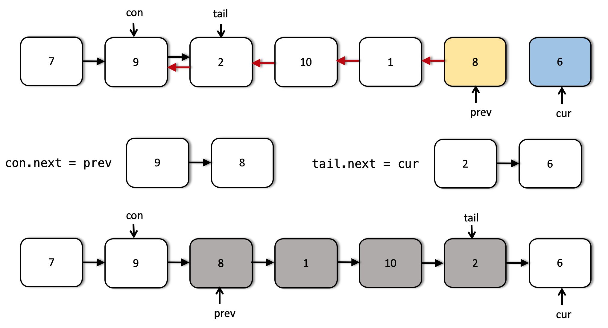

## 19 反转链表 II

反转从位置 m 到 n 的链表。请使用一趟扫描完成反转。

说明: 1 ≤ m ≤ n ≤ 链表长度。

示例:

```
输入: 1->2->3->4->5->NULL, m = 2, n = 4
输出: 1->4->3->2->5->NULL
```

[92. 反转链表 II](https://leetcode-cn.com/problems/reverse-linked-list-ii/)


[题解来源官网](https://leetcode-cn.com/problems/reverse-linked-list-ii/solution/fan-zhuan-lian-biao-ii-by-leetcode/)

### 迭代，相邻反转 


反转 m 到 n 部分的链表，并重新连接，情况如下：





```java
class Solution {
    public ListNode reverseBetween(ListNode head, int m, int n) {
        if(head==null) return head;
        ListNode pre = null, cur = head;
        //先走m-1步
        n = n-m+1;
        while(m-->1){
            pre = cur;
            cur = cur.next;
        }

        //记录当前位置
        ListNode con = pre, tail = cur;

        //反转链表
        while (n-->0){
            ListNode t = cur.next;
            cur.next = pre;
            pre = cur;
            cur = t;
        }

        //重新连接链表
        if (con != null) {
            con.next = pre;
        } else {
            head = pre;
        }

        tail.next = cur;
        return head;
    }
}
```

* 时间复杂度: O(N)。考虑包含 N 个结点的链表。（第 n 个结点之后的结点不处理）。

* 空间复杂度: O(1)。仅仅在原有链表的基础上调整了一些指针，只使用了 O(1) 的额外存储空间来获得结果。


### 迭代，遍历 m~n，不断向前插入


### 递归


