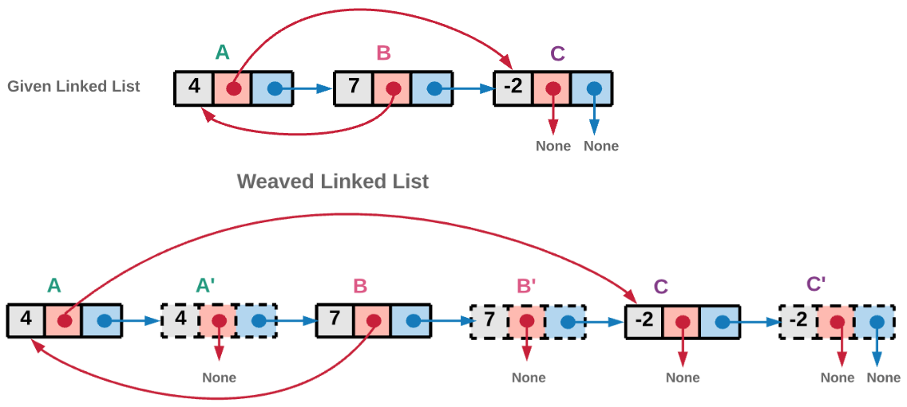
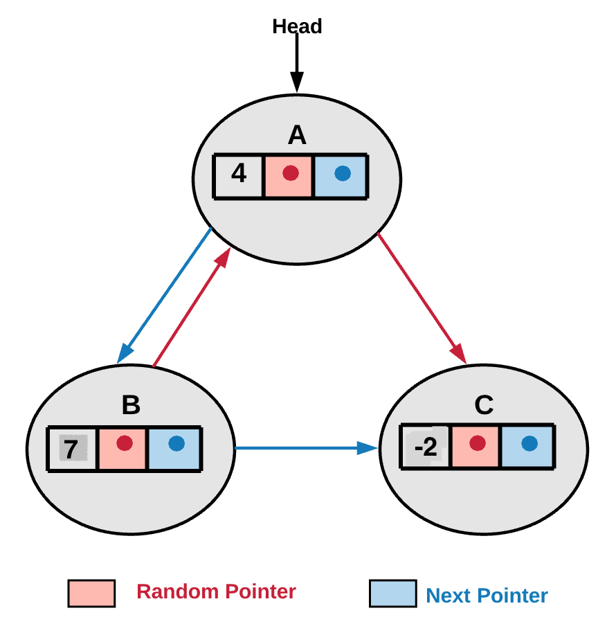

## 21 复制带随机指针的链表

给定一个链表，每个节点包含一个额外增加的随机指针，该指针可以指向链表中的任何节点或空节点。要求返回这个链表的深拷贝。 

用一个由 n 个节点组成的链表来表示输入/输出中的链表。每个节点用一个 [val, random_index] 表示：

* val：一个表示 Node.val 的整数。
* random_index：随机指针指向的节点索引（范围从 0 到 n-1）；如果不指向任何节点，则为 null 。
 
[138. 复制带随机指针的链表](https://leetcode-cn.com/problems/copy-list-with-random-pointer/)

链表结构如下：

```java
class Node {
    int val;
    Node next;
    Node random;

    public Node(int val) {
        this.val = val;
        this.next = null;
        this.random = null;
    }
}
```

示例


```
输入：head = [[7,null],[13,0],[11,4],[10,2],[1,0]]
输出：[[7,null],[13,0],[11,4],[10,2],[1,0]]
```


```
输入：head = [[1,1],[2,1]]
输出：[[1,1],[2,1]]
```

### O(1) 空间的迭代

1. 遍历原来的链表并拷贝每一个节点，将拷贝节点放在原来节点的旁边，创造出一个旧节点和新节点交错的链表。

2. 迭代这个新旧节点交错的链表，并用旧节点的 random 指针去更新对应新节点的 random 指针。比方说，B 的 random 指针指向 A ，意味着 B' 的 random 指针指向 A' 。

3. next 指针也需要被正确赋值，以便将新的节点正确链接同时将旧节点重新正确链接。(即拆分新旧链表！)



```java
class Solution {
    public Node copyRandomList(Node head) {
        if(head==null) return head;

        //a->b->c to a->a'->b->b'->c->c'
        Node ptr = head;
        while (ptr!=null){
            Node t = new Node(ptr.val);
            t.next = ptr.next;
            ptr.next = t;
            ptr = t.next;
        }

        //连接 random 指针
        ptr = head;
        while (ptr!=null){
            //随机指针有可能指向空
            ptr.next.random = (ptr.random!=null)?ptr.random.next:null;
            ptr = ptr.next.next;
        }

        //拆分为新旧两个链表
        Node newHead = head.next;
        Node p1 = head, p2=head.next;
        while (p1!=null){
            p1.next = p1.next.next;
            p2.next = p2.next!=null? p2.next.next:null; //最后一个节点时
            p1 = p1.next;
            p2 = p2.next;
        }

        return newHead;
    }
}
```

复杂度分析

* 时间复杂度：O(N)

* 空间复杂度：O(1)


### 回溯

思路：将链表想象成一张图。链表中每个节点都有 2 个指针（图中的边）。因为随机指针给图结构添加了随机性，所以可能会访问相同的节点多次，这样就形成了环。只需要遍历整个图并拷贝它。拷贝的意思是每当遇到一个新的未访问过的节点，都需要创造一个新的节点。遍历按照深度优先进行。需要在回溯的过程中记录已经访问过的节点，否则因为随机指针的存在可能会产生死循环。


算法步骤：

1）从头指针开始遍历整个图



2）当遍历到某个点时，如果已经有了当前节点的一个拷贝，不需要重复进行拷贝。

3）如果还没拷贝过当前节点，创造一个新的节点，并把该节点放到已访问字典中，即：

`visited_dictionary[current_node] = cloned_node_for_current_node`

4）针对两种情况进行回溯调用：一个顺着 random 指针调用，另一个沿着 next 指针调用。步骤 1 中将 random 和 next 指针分别红红色和蓝色标注。然后分别对两个指针进行函数递归调用：

```java
cloned_node_for_current_node.next = copyRandomList(current_node.next);
cloned_node_for_current_node.random = copyRandomList(current_node.random);
```

```java
class Solution {
    // HashMap which holds old nodes as keys and new nodes as its values.
    HashMap<Node, Node> visitedHash = new HashMap<Node, Node>();

    public Node copyRandomList(Node head) {
        if(head==null) return head;

        if (this.visitedHash.containsKey(head)) {
            return this.visitedHash.get(head);
        }

        Node node = new Node(head.val,null,null);
        this.visitedHash.put(head, node);
        node.next = copyRandomList(head.next);
        node.random = copyRandomList(head.random);
        return node;
    }
}
```


### O(N) 空间的迭代


