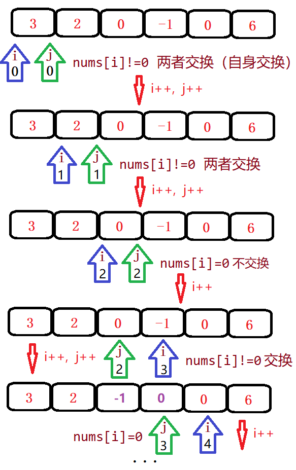

## 5 移动零

给定一个数组 nums，编写一个函数将所有 0 移动到数组的末尾，同时保持非零元素的相对顺序。

```
示例:
输入: [0,1,0,3,12]
输出: [1,3,12,0,0]
```

说明:

* 必须在原数组上操作，不能拷贝额外的数组。
* 尽量减少操作次数。

[283. 移动零](https://leetcode-cn.com/problems/move-zeroes/)

### 一次遍历

参考了快速排序的思想，快速排序首先要确定一个待分割的元素做中间点 x，然后把所有小于等于 x 的元素放到 x 的左边，大于 x 的元素放到其右边。用 0 当做这个中间点，把不等于 0 (注意题目没说不能有负数)的放到中间点的左边，等于 0 的放到其右边。



```java
class Solution {
    public void moveZeroes(int[] nums) {
        if(nums==null) return;
        int j=0;
        for(int i=0; i<nums.length; i++){
            //当前数不为0，则交换i与j
            if(nums[i]!=0){
                int temp = nums[i];
                nums[i] = nums[j];
                nums[j++] = temp;
            }
        }
    }
}
```
