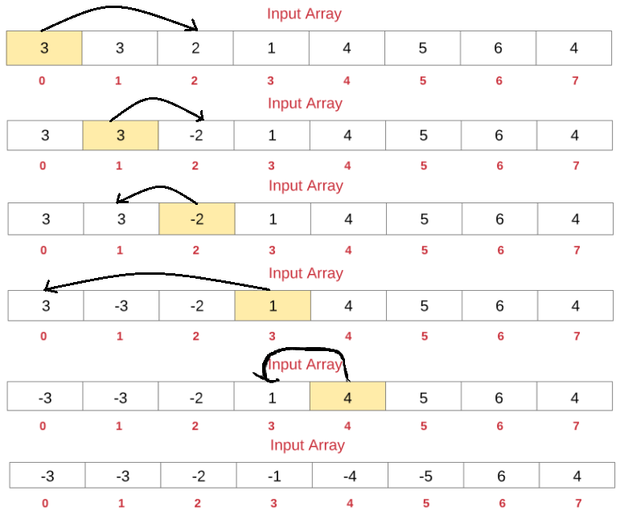

## 6 找到所有数组中消失的数字

给定一个范围在  1 ≤ a[i] ≤ n ( n = 数组大小 ) 的 整型数组，数组中的元素一些出现了两次，另一些只出现一次。

找到所有在 [1, n] 范围之间没有出现在数组中的数字。

您能在不使用额外空间且时间复杂度为O(n)的情况下完成这个任务吗? 你可以假定返回的数组不算在额外空间内。

```
示例:
输入:
[4,3,2,7,8,2,3,1]
输出:
[5,6]
```

[448. 找到所有数组中消失的数字](https://leetcode-cn.com/problems/find-all-numbers-disappeared-in-an-array/)


### 原地修改

思路如下：




```java
class Solution {
    public List<Integer> findDisappearedNumbers(int[] nums) {
        for(int i=0; i<nums.length; i++){
            int newIndex = Math.abs(nums[i])-1;
            if(nums[newIndex]>0){
                nums[newIndex] *= -1;
            }
        }
        List<Integer> res = new LinkedList<>();
        for(int i=1; i<=nums.length; i++){
            if(nums[i-1]>0){
                res.add(i);
            }
        }
        return res;
    }
}
```

### 哈希表


```java
class Solution {
    public List<Integer> findDisappearedNumbers(int[] nums) {
        HashSet<Integer> set = new HashSet<>();
        for(int i=0; i<nums.length; i++){
            set.add(nums[i]);
        }
        List<Integer> res = new LinkedList<>();
        for(int i=1; i<=nums.length; i++){
            if(!set.contains(i)){
                res.add(i);
            }
        }
        return res;
    }
}
```


复杂度分析

* 时间复杂度：O(N)。

* 空间复杂度：O(N)。