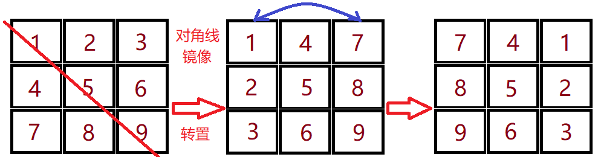

## 13 旋转图像

给定一个 n × n 的二维矩阵表示一个图像。

将图像顺时针旋转 90 度。

说明：必须在原地旋转图像，这意味着需要直接修改输入的二维矩阵。请不要使用另一个矩阵来旋转图像。

```
示例 1:

给定 matrix = 
[
  [1,2,3],
  [4,5,6],
  [7,8,9]
],

原地旋转输入矩阵，使其变为:
[
  [7,4,1],
  [8,5,2],
  [9,6,3]
]
```

[48. 旋转图像](https://leetcode-cn.com/problems/rotate-image/)


### 转置加翻转

先转置矩阵，然后反转每一行



```java
class Solution {
    public void rotate(int[][] matrix) {
        int n = matrix.length;
        //转置
        for(int i=0;i<n;i++){
            for(int j=i;j<n;j++){
                int temp = matrix[i][j];
                matrix[i][j] = matrix[j][i];
                matrix[j][i] = temp;
            }
        }
        //反转每一行
        for(int i=0; i<n; i++){
            for(int j=0; j<n/2; j++){
                int temp = matrix[i][j];
                matrix[i][j] = matrix[i][n-j-1];
                matrix[i][n-j-1] = temp;
            }
        }
    }
}
```


复杂度分析

* 时间复杂度：O(N^2).

* 空间复杂度：O(1) 由于旋转操作是就地完成的。


### 从外圈向内一圈一圈转


```java
class Solution {
    public void rotate(int[][] matrix) {
        int tR = 0;
        int tC = 0;
        int dR = matrix.length - 1;
        int dC = matrix[0].length - 1;
        while (tR < dR) {
            rotateEdge(matrix, tR++, tC++, dR--, dC--);
        }
    }
    public void rotateEdge(int[][] m, int tR, int tC, int dR, int dC) {
        int times = dC - tC;
        int tmp = 0;
        for (int i = 0; i != times; i++) {
            tmp = m[tR][tC + i];
            m[tR][tC + i] = m[dR - i][tC];
            m[dR - i][tC] = m[dR][dC - i];
            m[dR][dC - i] = m[tR + i][dC];
            m[tR + i][dC] = tmp;
        }
    }
}
```


